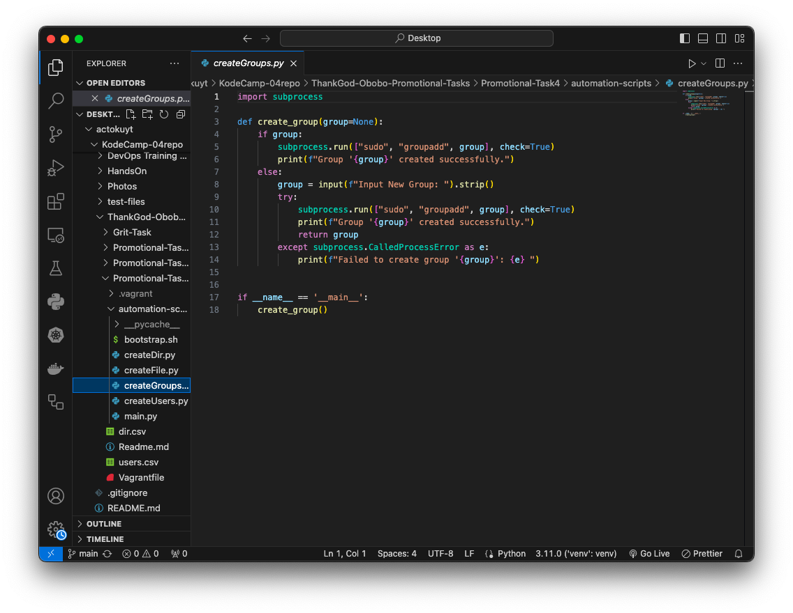
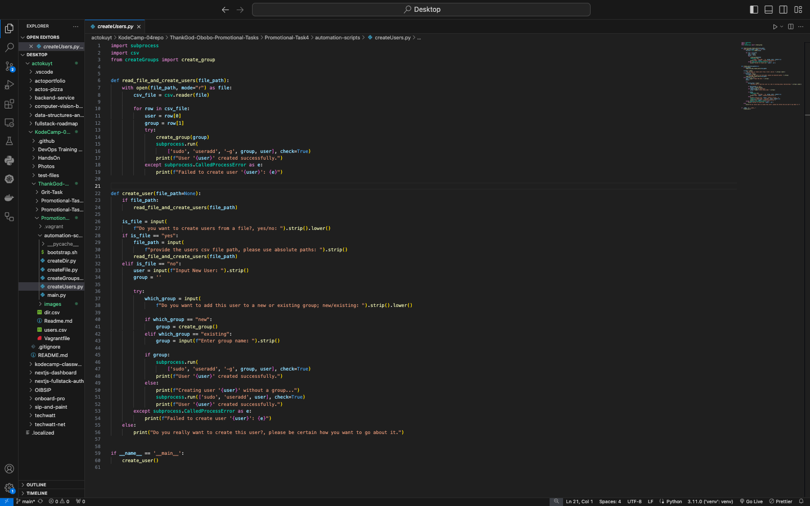
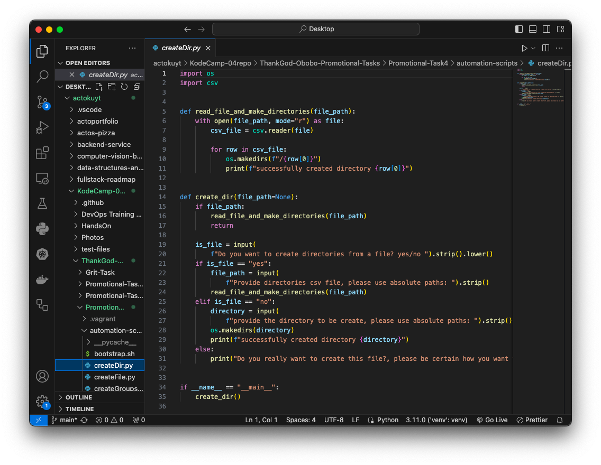
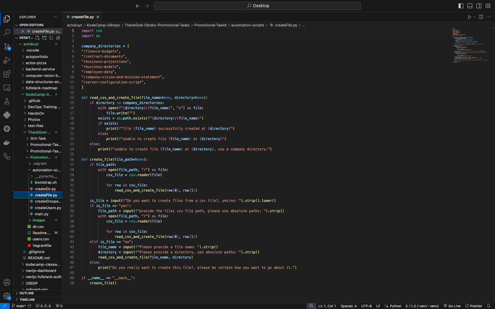
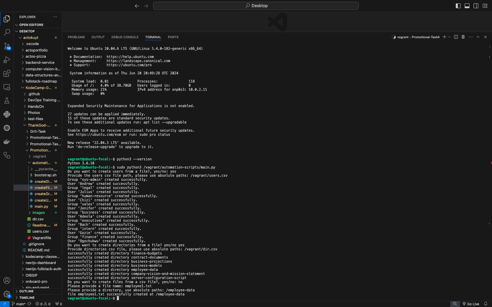

# Promotional Task 4

This is a breakdown of the steps I took to set up the infrastructure servers of a small business.

### Using Python, create the following users, and assign them to groups

- I wrote a python script/module using the built-in  subprocess module to automate the creation of groups on a linux environment. The module provides a function which optionally takes an argument "group" and calls $sudo groupadd on the group variable passed. In a case where the group variable is not provided the function requests for the user to input it. 

- Next, I wrote another module, still with the built-in subprocess and csv module which automates the creation of users and assigning them to groups. This module makes available a function create_user, which takes an optional argument file_path. The function creates a new user from the file provided, by calling a callback function on it. In a case where the file is not provided, the user is prompted to decide whether to create the users from a file or to manually input them.

### Using Python, create the following directories

I wrote a python module using the built-in os and csv module, which automates the creation of directories. It provides the function create_dir which accepts an optional argument file_path. It creates the directories by calling a callback function on the csv file provided. In a case where the file_path is not provided, the function inquires from the user whether he wants to provide a file or create the directories manually.

### Include a feature that takes user input and creates a file in your code. User input should include: 
- Name of file
- Directory to create the file
- Don't create the file if the Directory name is not one of the company directories.

For this I wrote another module using the built-in os and csv modules which automates the creation of files. The module makes available the function create_file, which takes an optional argument file_path and creates files from it's content. In a case where a file isn't specified, the function inquires from the user whether he wants to create the file from a list of files or manually.

## Summary
To put it all together I've created an entry script which when executed, calls all this other modules in turn and ensures that all resources required are created. Here's a summary of the result from executing the code using two csv files for the users and directories and creating a random file "employee1.txt" in the /employee-data directory.

