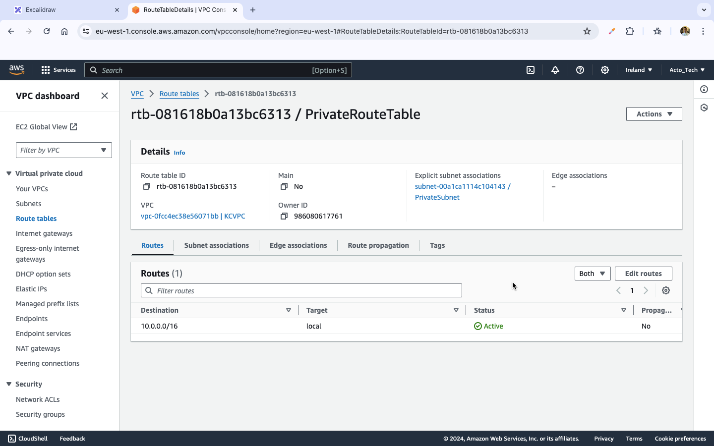

# Promotional Task 5

For this task we'll be setting up a simple AWS VPC that will have two servers in separate subnets connected to the internet via an internet gateway. The following diagram is the achitecture of the resulting system.

## Steps

### Create A VPC
I searched for VPC in the AWS management console and navigated to the VPC dashboard from where I clicked create VPC and filled out the form to create a new VPC.

### Create Subnets

I clicked on subnets at the left sidebar and clicked on create subnet, filled out the form to create two subnets one for public facing instances and another for private facing instances.

### Create an Internet Gateway

Also on the left sidebar, I clicked Internet Gateway then create internet gateway and filled the form to create an internet gateway. Then clicked on actions and attached it to the KCVPC VPC.

### Create Route Tables

On the left sidebar I clicked route tables and created two route tables one for the public facing subnet and another for the private facing subnet. I also associated the route tables to their respective subnets, configuring the public route table to route internet traffic through the internet gateway. 

### Create NAT Gateway

On the left sidebar I clicked NAT gatway and created a new NAT gateway in the public subnet, assigning an elastic IP to it. I also added an entry on the private route table to route internet traffic through the NAT gateway.

### Create Security Groups

On the left sidebar under the security pane, I clicked security groups and created two new security groups, one for public facing instances and the other for private instances.

### Create NACLs

Still on the left sidebar under the security pane I clicked network ACLs and created two NACLs one for the public subnet and the other for the private subnet. I also set inbound and outbound rules for each of them.

### Deploy Instances

I searched for EC2 and navigated to the EC2 management console from where I launched two EC2 instances, with the ubuntu server 24.04 LTS AMI and a t2.micro instance type. One was launched in the public subnet assigned a public IP and associated with the public security group created above. The other was launched in the private subnet and associated with the private security group also created above.

After all the setup I tried to connect to the public EC2 from my terminal via ssh and also log into the private EC2 via the public EC2.

## Description of Resources and Services

### VPC

Amazon Virtual Private Cloud (VPC) is a service that allows you to launch AWS resources in a logically isolated virtual network. You have complete control over your virtual networking environment, including the selection of your own IP address range, creation of subnets, and configuration of route tables and network gateways. It's basically your personal network within AWS.

### Subnets

A subnet is a segment of a VPC's IP address range where you can place groups of isolated resources. Subnets allow you to partition the VPC's address space into smaller segments, making it easier to manage and secure your AWS resources. It's basically a smaller section of your personal network, which makes administration easier and more effective.

### Internet Gateway

An Internet Gateway (IGW) is a VPC component that allows communication between instances in your VPC and the internet. It serves as a target in your VPC route tables for internet-routable traffic.

### Route Tables

A route table in AWS is used to determine how network traffic is directed within your Virtual Private Cloud (VPC). It contains a set of rules, called routes, that specify the allowed paths for outbound and inbound traffic to and from the subnet(s) associated with that route table.

### NAT Gateway

A NAT (Network Address Translation) Gateway is a service provided by AWS that allows instances in a private subnet to connect to the internet or other AWS services, but prevents the internet from initiating a connection to those instances. NAT Gateways are often used to provide outbound internet access to instances that do not have a public IP address.

### Security Groups

Security Groups are virtual firewalls for your Amazon EC2 instances to control inbound and outbound traffic. They operate at the instance level, providing security at the instance interface level rather than at the subnet or network level.

### NACLs

Network Access Control Lists (NACLs) are an optional layer of security for your Amazon Virtual Private Cloud (VPC) that acts as a firewall for controlling traffic in and out of one or more subnets. Unlike security groups, which provide instance-level security, NACLs operate at the subnet level.

### EC2

Amazon Elastic Compute Cloud (Amazon EC2) is a web service that provides resizable compute capacity in the cloud. It is designed to make web-scale cloud computing easier for developers by providing them with virtual servers, known as instances, on which they can run applications.