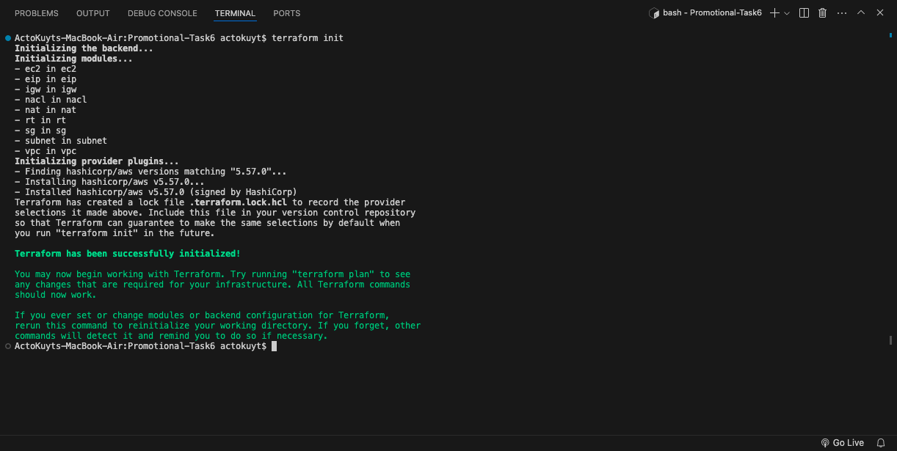
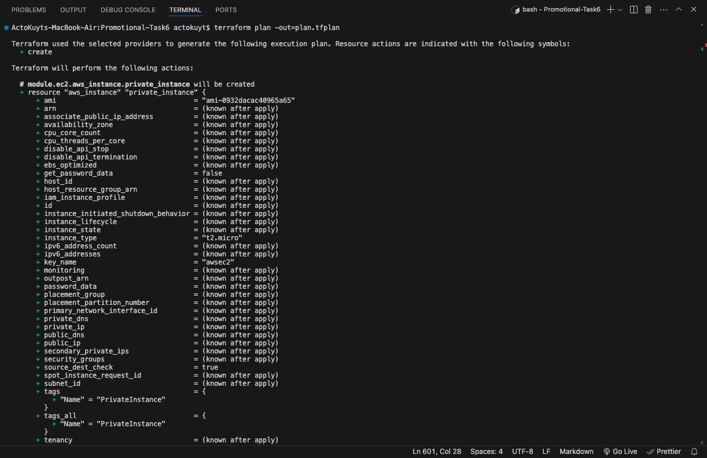
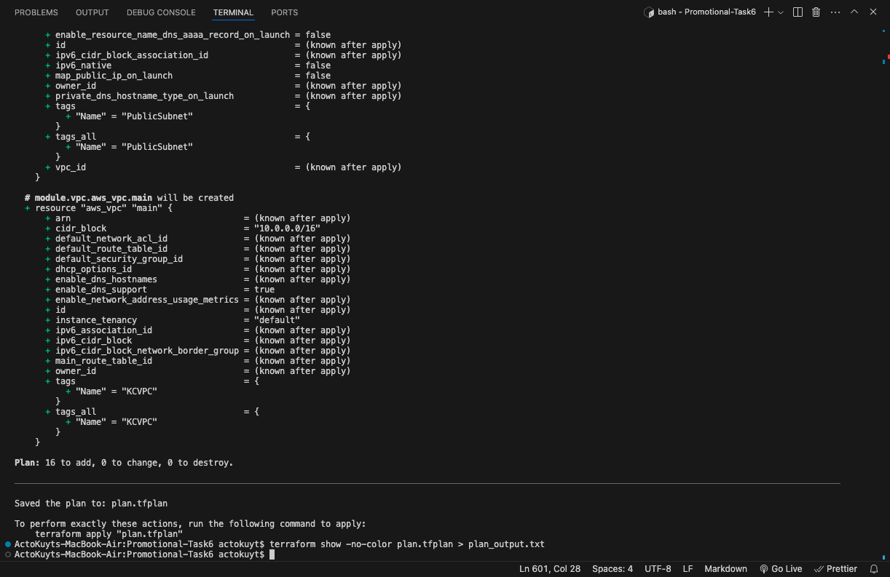
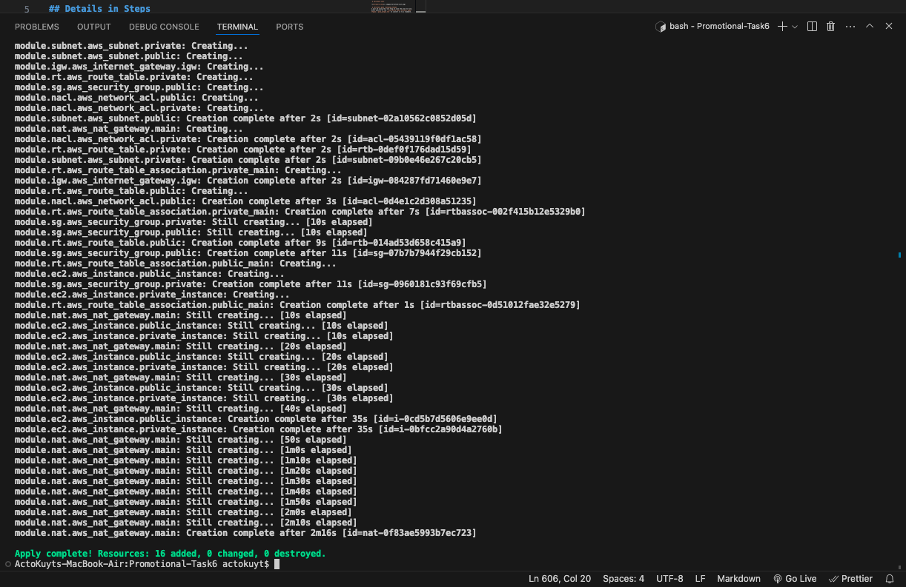
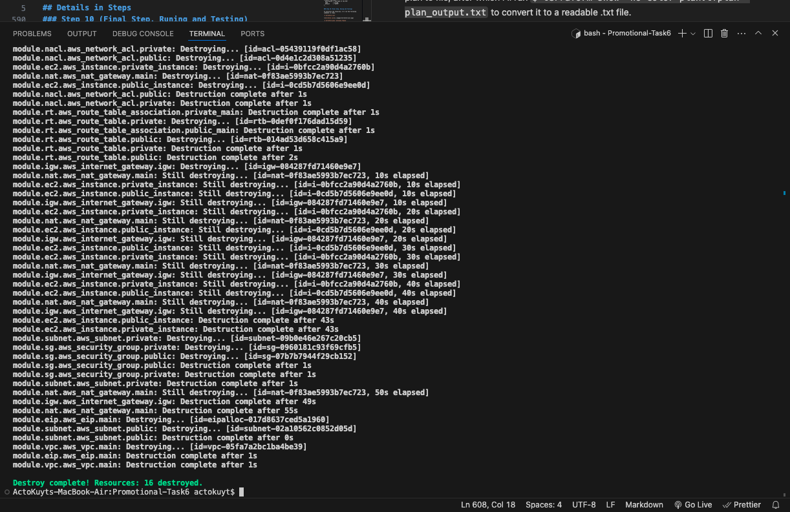

# Promotional Task 6

The objective of this task is to automate the provision of resources on AWS using terraform.

## Details in Steps

### Step 1 (Create a VPC)

Create a VPC directory to hold the VPC module and create a main.tf file, variables.tf file and an output.tf file. The following are the contents of the aforementioned files.

```
# main.tf

resource "aws_vpc" "main" {
  cidr_block = var.cidr_block

  tags = {
    Name = var.vpc_name
  }
}
```

```
# outputs.tf

output "vpc_id" {
  value = aws_vpc.main.id
}
```

```
# variables.tf

variable "cidr_block" {
  description = "The CIDR block for the VPC"
  type        = string
  default     = "10.0.0.0/16"
}

variable "vpc_name" {
  description = "The name of the VPC"
  type        = string
  default     = "KCVPC"
}
```

### Step 2 (Create Subnets)

Create a subnet directory to hold the subnet module and create a main.tf file, variables.tf file and an output.tf file. The following are the contents of the aforementioned files.

```
# main.tf

resource "aws_subnet" "public" {
  vpc_id            = var.vpc_id
  cidr_block        = "10.0.1.0/24"
  availability_zone = "eu-west-1a"

  tags = {
    Name = "PublicSubnet"
  }
}

resource "aws_subnet" "private" {
  vpc_id            = var.vpc_id
  cidr_block        = "10.0.2.0/24"
  availability_zone = "eu-west-1a"

  tags = {
    Name = "PrivateSubnet"
  }
}
```

```
# outputs.tf

output "public_subnet_id" {
  value = aws_subnet.public.id
}

output "private_subnet_id" {
  value = aws_subnet.private.id
}
```

```
# variables.tf

variable "vpc_id" {
  description = "The ID of the VPC"
  type        = string
}
```

### Step 3 (Create an Internet Gateway)

Create an igw directory to hold the igw module and create a main.tf file, variables.tf file and an output.tf file. The following are the contents of the aforementioned files.

```
# main.tf

resource "aws_internet_gateway" "igw" {
  vpc_id = var.vpc_id

  tags = {
    Name = "KCVPCIGW"
  }
}
```

```
# outputs.tf

output "gateway_id" {
  value = aws_internet_gateway.igw.id
}
```

```
# variables.tf

variable "vpc_id" {
  description = "value of vpc id"
  type        = string
}
```

### Step 4 (Create Route Tables)

Create an rt directory to hold the rt module and create a main.tf file and a variables.tf file. The following are the contents of the aforementioned files.

```
# main.tf

resource "aws_route_table" "public" {
  vpc_id = var.vpc_id

  route {
    cidr_block = "0.0.0.0/0"
    gateway_id = var.gateway_id
  }

  tags = {
    Name = "PublicRouteTable"
  }
}

resource "aws_route_table_association" "public_main" {
  subnet_id = var.public_subnet_id
  route_table_id = aws_route_table.public.id

}

resource "aws_route_table" "private" {
  vpc_id = var.vpc_id

  route = []

  tags = {
    Name = "PrivateRouteTable"
  }
}

resource "aws_route_table_association" "private_main" {
  subnet_id = var.private_subnet_id
  route_table_id = aws_route_table.private.id

}
```

```
# variables.tf

variable "vpc_id" {
  description = "value of vpc id"
  type        = string
}

variable "gateway_id" {
  description = "value of igw_id"
  type        = string
}

variable "public_subnet_id" {
  description = "value of public subnet id"
  type = string
}

variable "private_subnet_id" {
  description = "value of private subnet id"
  type = string
}
```

### Step 5 (Create a NAT Gateway)

Create a nat directory to hold the nat gateway module and create a main.tf file and a variables.tf file. The following are the contents of the aforementioned files.

```
# main.tf

resource "aws_nat_gateway" "main" {
  allocation_id = var.eip_id
  subnet_id     = var.subnet_id

  tags = {
    Name = "NAT"
  }
}
```

```
# variables.tf

variable "eip_id" {
  description = "value of eip id"
  type = string
}

variable "subnet_id" {
  description = "value of subnet id"
  type = string
}
```

### Step 6 (Create Security Groups)

Create a sg directory to hold the Security Group module and create a main.tf file, variables.tf file and an output.tf file. The following are the contents of the aforementioned files.

```
# main.tf

resource "aws_security_group" "public" {
  vpc_id = var.vpc_id

  tags = {
    Name = "PublicSG"
  }

  ingress {
    description = "Allow HTTP traffic"
    from_port   = 80
    to_port     = 80
    protocol    = "tcp"
    cidr_blocks = ["0.0.0.0/0"]
  }

  ingress {
    description = "Allow HTTPS traffic"
    from_port   = 443
    to_port     = 443
    protocol    = "tcp"
    cidr_blocks = ["0.0.0.0/0"]
  }

  ingress {
    description = "Allow SSH traffic"
    from_port   = 22
    to_port     = 22
    protocol    = "tcp"
    cidr_blocks = ["102.90.44.68/32"]
  }

  egress {
    description = "Allow all outbound traffic"
    from_port   = 0
    to_port     = 0
    protocol    = "-1"
    cidr_blocks = ["0.0.0.0/0"]
  }
}


resource "aws_security_group" "private" {
  vpc_id = var.vpc_id

  tags = {
    Name = "PrivateSG"
  }

  ingress {
    description = "Allow PostgreSQL traffic from Public Subnet"
    from_port   = 5432
    to_port     = 5432
    protocol    = "tcp"
    cidr_blocks = ["10.0.1.0/24"]
  }

  egress {
    description = "Allow all outbound traffic"
    from_port   = 0
    to_port     = 0
    protocol    = "-1"
    cidr_blocks = ["0.0.0.0/0"]
  }
}
```

```
# outputs.tf

output "public_sg_id" {
  value = aws_security_group.public.id
}

output "private_sg_id" {
  value = aws_security_group.private.id
}
```

```
# variables.tf

variable "vpc_id" {
  description = "value of vpc id"
  type = string
}
```

### Step 7 (Create Network ACLs)

Create a nacl directory to hold the Network ACLs module and create a main.tf file and a variables.tf file. The following are the contents of the aforementioned files.

```
# main.tf

resource "aws_network_acl" "public" {
  vpc_id = var.vpc_id

  tags = {
    Name = "PublicNACL"
  }

  ingress {
    rule_no    = 100
    protocol   = "tcp"
    action     = "allow"
    cidr_block = "0.0.0.0/0"
    from_port  = 80
    to_port    = 80
  }

  ingress {
    rule_no    = 110
    protocol   = "tcp"
    action     = "allow"
    cidr_block = "0.0.0.0/0"
    from_port  = 443
    to_port    = 443
  }

  ingress {
    rule_no    = 120
    protocol   = "tcp"
    action     = "allow"
    cidr_block = "0.0.0.0/0"
    from_port  = 22
    to_port    = 22
  }

  egress {
    rule_no    = 100
    protocol   = "-1"
    action     = "allow"
    cidr_block = "0.0.0.0/0"
    from_port  = 0
    to_port    = 0
  }
}

resource "aws_network_acl" "private" {
  vpc_id = var.vpc_id

  tags = {
    Name = "PrivateNACL"
  }

  ingress {
    rule_no    = 100
    protocol   = "tcp"
    action= "allow"
    cidr_block = "10.0.1.0/24"
    from_port  = 22
    to_port    = 22
  }

  egress {
    rule_no    = 110
    protocol   = "-1"
    action= "allow"
    cidr_block = "0.0.0.0/0"
    from_port  = 0
    to_port    = 0
  }
}
```

```
# variables.tf

variable "vpc_id" {
  description = "value of vpc id"
  type = string
}
```

### Step 8 (Deploy Istances)

Create an ec2 directory to hold the EC2 module and create a main.tf file and a variables.tf file. I've also added a bash script to install nginx and postgresql on the public ec2 instance upon provision. The following are the contents of the aforementioned files.

```
# main.tf

resource "aws_instance" "public_instance" {
  ami             = var.ami_id
  instance_type   = var.instance_type
  subnet_id       = var.public_subnet_id
  security_groups = [var.public_sg_id]
  key_name        = var.key_name

  associate_public_ip_address = true

  user_data = file("${path.module}/../scripts/main.sh")

  tags = {
    Name = "PublicInstance"
  }
}

resource "aws_instance" "private_instance" {
  ami             = var.ami_id
  instance_type   = var.instance_type
  subnet_id       = var.private_subnet_id
  security_groups = [var.private_sg_id]
  key_name        = var.key_name

  tags = {
    Name = "PrivateInstance"
  }
}
```

```
# Variables.tf

variable "ami_id" {
  description = "AMI ID for the EC2 instance"
  type = string
  default = "ami-0932dacac40965a65"
}

variable "instance_type" {
  description = "Instance type for the EC2 instance"
  type = string
  default = "t2.micro"
}

variable "key_name" {
  description = "ssh key pair name"
  type = string
  default = "awsec2"
}

variable "private_sg_id" {
  description = "value of private security group"
  type = string
}

variable "public_sg_id" {
  description = "value of public security group"
  type = string
}

variable "public_subnet_id" {
  description = "Subnet ID for the public subnet"
  type = string
}

variable "private_subnet_id" {
  description = "Subnet ID for the private subnet"
  type = string
}

```

```
# bash Script

#!/bin/bash
sudo apt-get update
sudo apt-get install -y nginx
sudo apt-get install -y postgresql
```

### Step 9 (Create the Main/Entry Module)

To put every thing together I have created an entry main.tf file where I referenced all the other modules. The following is the content of the aforementined files.

```
# main.tf

terraform {
  required_providers {
    aws = {
      source  = "hashicorp/aws"
      version = "5.57.0"
    }
  }
}

provider "aws" {
  region = "eu-west-1"
}


module "vpc" {
  source = "./vpc"
}

module "subnet" {
  source = "./subnet"

  vpc_id = module.vpc.vpc_id
}

module "igw" {
  source = "./igw"

  vpc_id = module.vpc.vpc_id
}

module "rt" {
  source = "./rt"

  vpc_id            = module.vpc.vpc_id
  gateway_id        = module.igw.gateway_id
  private_subnet_id = module.subnet.private_subnet_id
  public_subnet_id  = module.subnet.public_subnet_id
}

module "eip" {
  source = "./eip"
}

module "nat" {
  source = "./nat"

  eip_id = module.eip.eip_id
  subnet_id = module.subnet.public_subnet_id
}

module "sg" {
  source = "./sg"

  vpc_id = module.vpc.vpc_id
}

module "nacl" {
  source = "./nacl"

  vpc_id = module.vpc.vpc_id
}

module "ec2" {
  source = "./ec2"

  public_subnet_id = module.subnet.public_subnet_id
  public_sg_id  = module.sg.public_sg_id
  private_subnet_id = module.subnet.private_subnet_id
  private_sg_id = module.sg.private_sg_id
}
```
```
# variable.tf

variable "cidr_block" {
  description = "The CIDR block for the VPC"
  type        = string
  default     = "10.0.0.0/16"
}

variable "vpc_name" {
  description = "The name of the VPC"
  type        = string
  default     = "KCVPC"
}
```

### Step 10 (Final Step, Runing and Testing)

To provision the resources, I'll run the following commands in steps.

`$ terraform init`



`$ terraform plan -out=plan.tfplan`
I will be using the -out flag to save the plan to file, after which I'll run `$ terraform show -no-color plan.tfplan > plan_output.txt` to convert it to a readable .txt file.




`$ terraform apply`



`$ terraform destroy`

